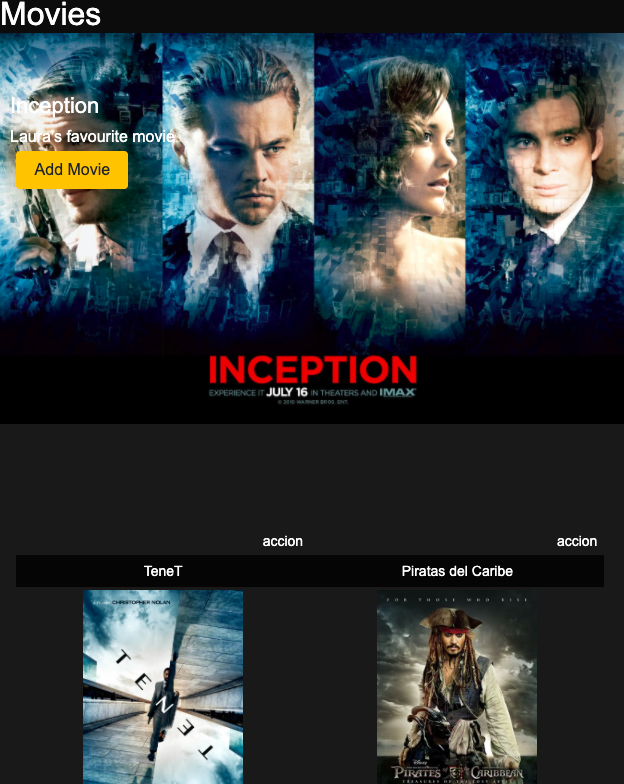
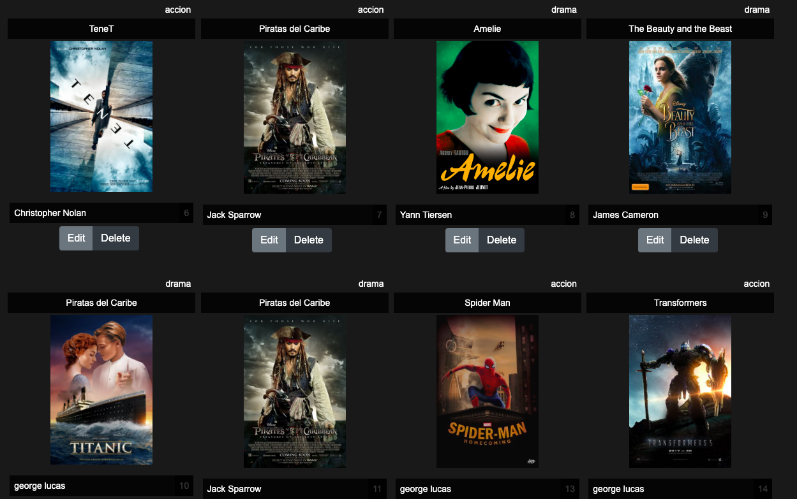
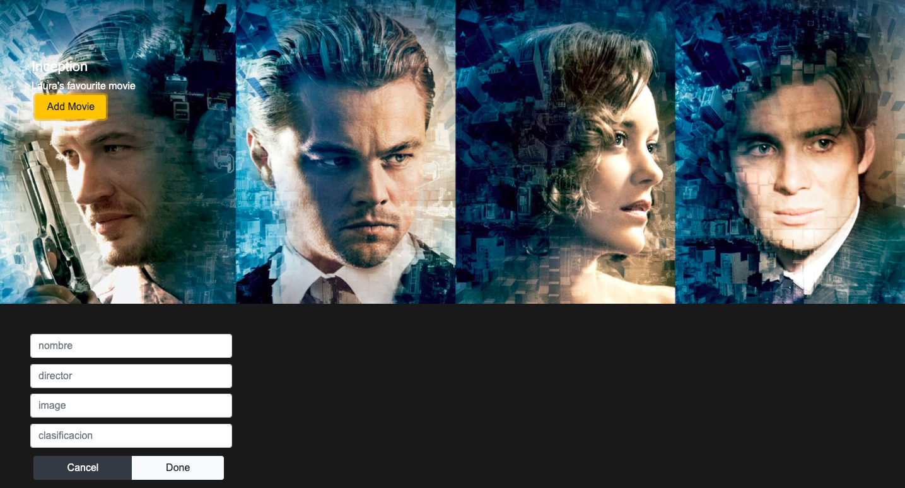

# Api películas
### Ejercicio Bootcamp F5

Crea con Postman un crud a la Api de películas

## Instalación

- Instala en global el servidor de la Fake Api

    sudo npm install -g json-server

- Ejecuta el json

    json-server --watch peliculas.json

- Instala Postman

    https://www.postman.com/

- Crea un Crud en Postman

- Crea un crud en un frontend.

    Utiliza una carpeta ./public/index.html para sustituir la página de inicio.

- Modifica el Json a tu gusto y añade imágenes de portada de las películas

### Home Page

### Movies 

### Add new Movie Form

### Edit Movie

